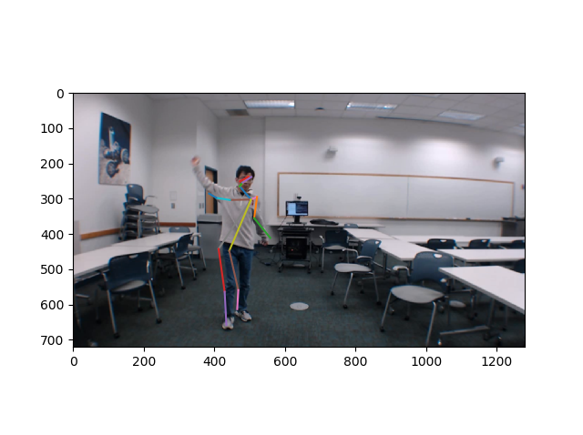

# RF signal and camera for indoor Localization 
This repository aims use Wifi signals and camera for indoor localization. The camera is mainly used to help the machine learning model to learn how to extract pose coordinates from Wifi Channel State Information Data.
## Getting Started


### Dependencies

#### (Recommended) Install with conda
* Python 3.9.16
* PyTorch 1.13.1
* HDF5 1.10.6
* Matplotlib 3.6.2
* OpenCV 4.6.0

### Installing
```
# 1. First clone this repository: 
git clone https://github.com/deolsatish/RPI-Project.git

# 2. Create a conda virtual environment.
conda create -n rpi python=3.9.16 -y
conda activate rpi

# 3. Install PyTorch
conda install pytorch torchvision torchaudio pytorch-cuda=11.6 -c pytorch -c nvidia

```

### Executing program

To execute Programs:

```
# 1. Run WiSPPN_master_test_PAM.ipynb on Jupyter Notebooks or other alternative
This piece of code tests the machine learning model with pre-trained models

# 2. Run train.py as a python file
This piece of code trains the machine learning model an saves the trained model

# 3. Run test_cam on Jupyter Notebooks or other alternative
This piece of code saves a duration of video footage from your webcam with its timestamps for each frame in a Json file

# 4. Go to Alphapose project folder to run it, it will require a different python environment. 
Alphapose allows us to generate 18-keypoint pose coordinates from our video.

```

#### If you are finding difficulties in running the code: here is a google collab version:
* WiSPPN_master_test_PAM.ipynb: https://colab.research.google.com/drive/1OguqFk87moYVn-gbRVkw29Q-FTfin16Y?usp=sharing
* Alphapose: https://colab.research.google.com/drive/1_3Wxi4H3QGVC28snL3rHIoeMAwI2otMR?usp=sharing


## Alphapose extracting pose coordinates from video

https://user-images.githubusercontent.com/52904167/220471380-a9732592-5cf4-4882-b73b-106dabdca66d.mp4


## 18 Keypoints Person Pose annotations


## Network Framework


## An Example



